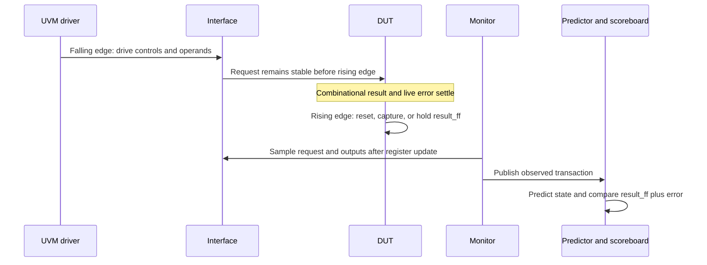
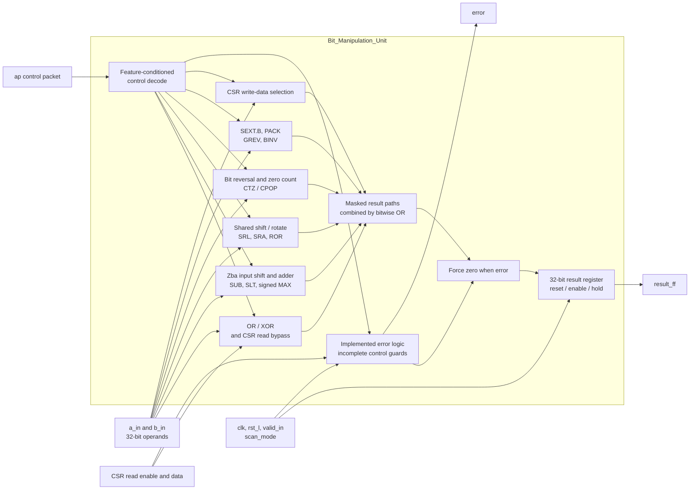
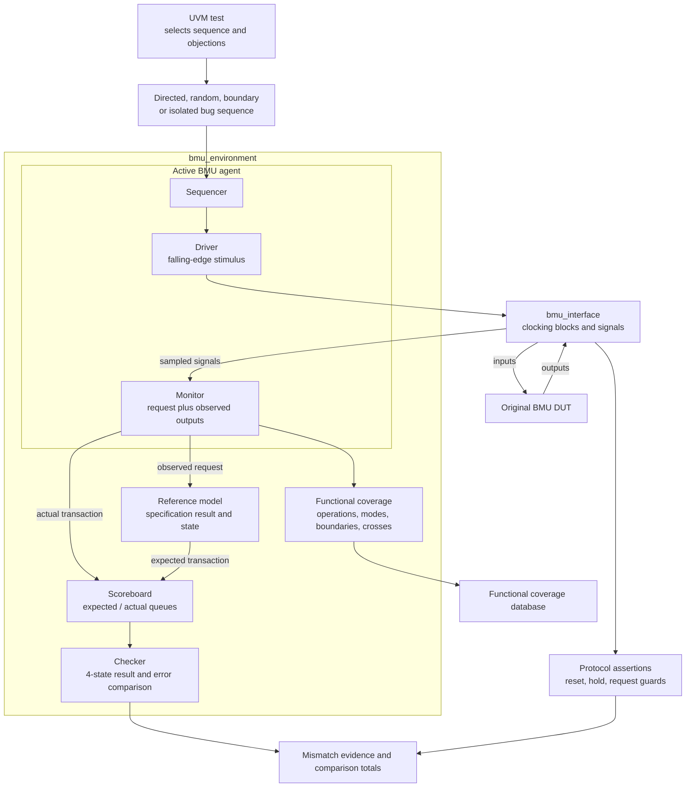

# BMU Verification Project

<div align="center">


**Specification-driven verification of a 32-bit RISC-V Bit Manipulation Unit.**

[Specification](docs/00_spec/BMU_Specification_v1.2.pdf) · [Test plan](docs/02_test_plan/BMU_Test_Plan.md) · [Bug log](docs/04_bug_reports/BMU_Bug_Log.md) · [Regression results](results/reports/regression_summary.csv)

</div>

The training objective is to **find, reproduce, and document bugs in the delivered RTL** against BMU Specification v1.2. This repository contains the UVM environment, specification-based predictor, directed and constrained-random stimulus, protocol assertions, isolated bug reproducers, and measured coverage needed to review that work.

The original DUT is preserved. The submitted regression completed **26 runs: 3 passed and 23 detected failures, with zero UVM fatals**. Nine DUT findings remain open. A failing bug-reproducer test is retained as a failure; reaching full functional coverage does not mean the DUT is correct.

## Table of contents

- [1. Project at a glance](#1-project-at-a-glance)
- [2. Supported operations and control rules](#2-supported-operations-and-control-rules)
- [3. DUT interface and timing](#3-dut-interface-and-timing)
- [4. DUT architecture](#4-dut-architecture)
- [5. UVM environment architecture](#5-uvm-environment-architecture)
- [6. Checking and assertions](#6-checking-and-assertions)
- [7. Test strategy and regression](#7-test-strategy-and-regression)
- [8. Coverage and measured results](#8-coverage-and-measured-results)
- [9. Confirmed bug findings](#9-confirmed-bug-findings)
- [10. Run and reproduce](#10-run-and-reproduce)
- [11. Repository and evidence map](#11-repository-and-evidence-map)
- [12. Assumptions and submission limits](#12-assumptions-and-submission-limits)

---

## 1. Project at a glance

| Item | Project baseline |
|---|---|
| Design under test | `Bit_Manipulation_Unit`, 32-bit operands and registered result |
| Verification authority | Supplied BMU Specification v1.2 and recorded clarifications |
| Functional scope | 17 operation classes, including CSR read and write-data selection |
| Methodology | SystemVerilog / UVM, active agent, independent predictor, scoreboard, assertions, functional coverage |
| Simulator | Cadence Xcelium 25.03-s006 with UVM 1.1d |
| Coverage tool | Cadence IMC 25.09-a020 |
| Recorded regression | 22 September 2026; effective seeds retained in reports |
| Predictor validation | 865 self-checks passed |
| Functional coverage | 100.00%, 562 of 562 bins exercised |
| Bug status | Nine open findings; eight major and one critical |
| Submission status | Verification evidence complete for the training submission; DUT correctness not signed off |

The verification baseline and source provenance are recorded in the [input baseline](docs/00_spec/verification_input_baseline.md) and [run manifest](results/reports/run_manifest.json). Separate `fix_v1` RTL and top-level files are exploratory; the default flow and the reported evidence use the original DUT.

## 2. Supported operations and control rules

All results are 32 bits. Arithmetic wraps modulo 2³². Shift and bit-index operations use `b_in[4:0]`; high bits of `b_in` must not change those results. The table describes **expected behavior**, including behavior that the delivered RTL currently violates.

| Operation | Expected result | Required mode or boundary |
|---|---|---|
| OR | `a_in OR b_in` | With `zbb=1`, invert `b_in` first |
| XOR | `a_in XOR b_in` | With `zbb=1`, invert `b_in` first |
| SRL | Logical right shift of `a_in` | Amount 0–31; zero fill |
| SRA | Arithmetic right shift of signed `a_in` | Amount 0–31; sign fill |
| ROR | Rotate `a_in` right | Amount 0 returns `a_in` |
| BINV | Toggle the indexed bit in `a_in` | Index 0–31 |
| SH2ADD | `(a_in << 2) + b_in` | Requires `sh2add=1` and `zba=1` |
| SUB | `a_in - b_in` | `zba` is forbidden |
| SLT / SLTU | 1 if `a_in < b_in`, otherwise 0 | Requires `slt=1` and `sub=1`; `unsign` selects signed/unsigned |
| CTZ | Number of trailing zero bits in `a_in` | `CTZ(0) = 32` |
| CPOP | Number of set bits in all 32 bits of `a_in` | Result range 0–32 |
| SEXT.B | Sign-extend `a_in[7:0]` | Sign comes from bit 7, independently of bit 31 |
| MAX | Signed maximum of `a_in` and `b_in` | Requires `max=1` and `sub=1`; unsigned mode is forbidden |
| PACK | `{b_in[15:0], a_in[15:0]}` | Only the low halfword of each operand is used |
| GREV | `{a_in[7:0], a_in[15:8], a_in[23:16], a_in[31:24]}` | Specified byte-reverse encoding: `b_in[4:0] = 24` |
| CSR write data | `b_in` when `csr_imm=1`, otherwise `a_in` | Requires `csr_write=1`; this block does not store a CSR |
| CSR bypass read | `csr_rddata_in` | `csr_ren_in=1` and all `ap` fields zero |

A legal request selects one operation and only its permitted companion fields. This is **not a one-hot check on every control bit**: `slt + sub`, `max + sub`, and `sh2add + zba` are legal combinations. Other operation fields, forbidden modifiers, missing required fields, and CSR conflicts are checked explicitly.

For an invalid request, the expected live `error` is 1. If `valid_in=1`, the captured result is zero; if `valid_in=0`, the previous result must hold while `error` still reflects the current request. An empty control packet without a CSR read is invalid outside reset.

Standalone operations without behavior tables in the supplied specification are outside the functional scope. These include CLZ, MIN, ROL, BSET/BCLR/BEXT, SLL/AND/ADD, SEXT.H, SH1ADD/SH3ADD, PACKU/PACKH, GORC, and branch/prediction behavior. Their control fields are still exercised as forbidden companions to specified operations.

## 3. DUT interface and timing

| Signal | Direction | Width | Purpose |
|---|---|---:|---|
| `clk` | Input | 1 | Result capture clock; testbench period is 10 ns |
| `rst_l` | Input | 1 | Active-low reset; result clears on a rising edge |
| `valid_in` | Input | 1 | Enables result capture; low means hold |
| `scan_mode` | Input | 1 | Normally zero; functional behavior follows the recorded assumption |
| `ap` | Input | 42 | Packed `rtl_alu_pkt_t` operation and modifier fields |
| `a_in`, `b_in` | Input | 32 each | Data operands |
| `csr_ren_in` | Input | 1 | CSR bypass read request |
| `csr_rddata_in` | Input | 32 | CSR bypass read data |
| `result_ff` | Output | 32 | Registered result |
| `error` | Output | 1 | Live combinational control-error indication |

There is no ready signal or output-valid handshake. The adopted contract is combinational computation followed by capture on a rising edge with `valid_in=1`. Reset takes priority over capture. `error` is suppressed during reset and is not registered or gated by `valid_in`.



The driver uses the falling-edge clocking block. The monitor samples on the rising edge with input skew `#0`, after nonblocking register updates, so the observed request is paired with its captured output. The timing sequence also checks that `result_ff` does not change before the capture edge. See the [interface](tb/interface/bmu_interface.sv) and [timing sequences](tb/sequences/reset_ops).

## 4. DUT architecture

This diagram shows the functional paths relevant to the verification scope. It summarizes the implementation rather than reproducing every internal wire.



The error block in the delivered RTL implements only part of the required guard behavior. It must not be interpreted as a complete specification checker; missing rejection paths are among the reported bugs. The parallel result paths also contain the data-selection, count, and permutation defects summarized below.

The checked-in parameter configuration enables ZBA, ZBB, ZBC, and ZBS, and disables ZBE, ZBF, ZBP, and ZBR. Feature enables do not expand this project's specification scope. PACK and the specified GREV behavior are available through the delivered ZBB gating even with ZBP disabled.

Source: [original DUT](rtl/Bit_Manipulation_Unit.sv), [parameters](rtl/rtl_param.sv), and [RTL library](rtl/rtl_lib.sv). A [static DUT diagram](docs/06_architecture_diagrams/bmu_dut_block_diagram.png) is also retained.

## 5. UVM environment architecture



The [top level](tb/top/bmu_tb_top.sv) instantiates the DUT and interface, distributes the virtual interface through the UVM configuration database, and starts the selected test. The [environment](tb/env/bmu_environment.sv) connects the monitor to three consumers: the reference model, actual scoreboard input, and coverage subscriber. The predictor's expected stream feeds the other scoreboard input.

Prediction is based on **observed inputs**, so checking uses what was driven to the DUT. The [reference model](tb/env/reference_model/bmu_reference_model.sv) uses specification expressions and explicit legal-control masks; it does not copy RTL datapaths or use DUT outputs to predict results. It tracks reset and held-result state. Specification classification helpers are shared with coverage, so coverage and prediction are not wholly independent implementations.

Functional coverage samples stimulus and scenario classifications. A transaction can therefore close a coverage bin while simultaneously exposing a DUT mismatch. The predictor self-test runs separately from the normal DUT-checking environment and validates 865 legal, illegal, boundary, and state cases.

## 6. Checking and assertions

The [scoreboard](tb/env/scoreboard/bmu_scoreboard.sv) queues expected and actual transactions and compares both `result_ff` and `error` through the [checker](tb/env/scoreboard/bmu_checker.sv). Four-state equality keeps X/Z differences visible. End-of-test checks flag unmatched transactions and tests with no active stimulus.

Each mismatch records the operation, reset, valid, scan, packed control fields, both operands, CSR enable/data, expected outputs, actual outputs, and simulation timestamp. Summary counters distinguish compared, matched, and mismatched transactions.

The [13 protocol properties](tb/assertions/bmu_protocol_assertions.sv) complement data checking:

| Property | What it checks |
|---|---|
| `reset_suppresses_error` | Reset suppresses the error output |
| `reset_clears_result` | Reset clears the registered result |
| `result_holds_when_invalid` | Deasserted `valid_in` holds the previous result |
| `valid_result_is_registered` | An enabled result is known; detailed timing is checked by sequences |
| `one_primary_operation` | Conflicting operations raise an error, accounting for legal companion fields |
| `empty_valid_request` | An enabled empty request raises an error |
| `live_error_when_invalid` | Conflicting primary operations still report an error while `valid_in=0` |
| `csr_conflict` | CSR read combined with operation controls raises an error |
| `sh2add_requires_zba` | SH2ADD without ZBA raises an error |
| `sub_rejects_zba` | SUB with forbidden ZBA raises an error |
| `slt_requires_sub` | SLT without SUB raises an error |
| `max_requires_sub` | MAX without SUB raises an error |
| `grev_encoding` | Unsupported GREV encodings raise an error under CLARIF-004 |

The simulation result checker rejects UVM errors/fatals, native simulator errors/fatals including assertion failures, and missing completion evidence. A simulator process returning zero is not sufficient to declare a test passing.

## 7. Test strategy and regression

The suite combines small diagnostic tests with systematic sweeps and seeded random exploration. The [full configuration](regression/configs/full.cfg) contains the following 26 runs:

| Test or family | Seeds | Runs | Purpose | Recorded outcome |
|---|---|---:|---|---|
| `bmu_model_self_test` | 1 | 1 | Validate the predictor independently | PASS; 865 checks |
| `bmu_or_valid_test` | 1 | 1 | Basic legal request and result capture | PASS |
| `bmu_timing_reset_test` | 1 | 1 | Capture timing, hold, reset, recovery, back-to-back traffic | PASS; 17 comparisons |
| `bmu_nominal_directed_test` | 1 | 1 | Nominal specified operations | FAIL; 7 mismatches |
| `bmu_error_directed_test` | 1 | 1 | Invalid controls and expected rejection | FAIL; 7 mismatches |
| `bmu_gap_checks_test` | 1 | 1 | Additional boundaries and control combinations | FAIL; 41 mismatches |
| `bmu_guard_matrix_test` | 1 | 1 | Systematic allowed/forbidden control matrix | FAIL; 1,215 mismatches |
| `bmu_coverage_closure_test` | 4 | 1 | Combined scenario and boundary sweep | FAIL; 1,548 mismatches |
| `bmu_legal_random_test` | 101, 102, 103 | 3 | Random legal operations, operands, and optional modes | All FAIL |
| `bmu_corner_random_test` | 201, 202, 203 | 3 | Independently selected operand corners | All FAIL |
| `bmu_error_random_test` | 301, 302, 303 | 3 | Random selection among ten invalid-request classes | All FAIL |
| `bmu_bug_NNN_test` | 1 for each bug | 9 | Isolate the nine documented findings | All FAIL as reproduced |

Each random run generates 100 requests plus a reset sample. Legal randomization includes all 17 operation classes, both OR/XOR inversion modes, both SLT signedness modes, and both CSR write-data sources. Corner operands include zero, all ones, signed minimum/maximum, one, alternating bits, and 31; operands are selected independently.

The systematic sequences cover:

- All 32 shift amounts and bit indices for SRL, SRA, ROR, and BINV, including nonzero high bits in `b_in`.
- CTZ and CPOP results 0–32, upper- and lower-half patterns, one-hot inputs, and zero input.
- Signed and unsigned comparisons, equal operands, opposite signs, arithmetic boundaries, and independent operand corners.
- All 256 low-byte values for SEXT.B, with upper-bit variation to separate bit 7 from bit 31.
- The legal GREV encoding and all 31 unsupported low-five-bit encodings.
- Legal requests and forbidden-field mutations for every operation with both values of `valid_in`, CSR conflicts, and missing required modifiers.
- Reset, result hold, capture timing, back-to-back requests, and recovery after invalid traffic.

For example, the guard matrix starts from legal `slt=1, sub=1`, adds forbidden fields one at a time, and separately removes `sub` to test the missing-companion guard. It treats SUB-to-SLT/MAX changes as legal operation changes when their required fields are present.

The [test plan](docs/02_test_plan/BMU_Test_Plan.md), [traceability matrix](docs/02_test_plan/traceability_matrix.md), and [randomization plan](docs/01_verification_plan/randomization_plan.md) map these checks to the specification. Shorter configurations are available for directed, gap, legal-random, corner-random, error-random, bug-only, and nightly runs.

## 8. Coverage and measured results

The coverage baseline is the original-DUT run `bmu_coverage_closure_test`, seed **4**. Its scoreboard compared **5,036 transactions: 3,488 matched and 1,548 mismatched**. The same run reported 513 native assertion failures and zero UVM fatals.

| Measurement | Recorded result | Interpretation |
|---|---:|---|
| Functional bins | 562 / 562 — **100.00%** | All defined functional scenarios exercised; IMC reports no remaining holes |
| DUT hierarchy blocks | 16 / 16 — **100.00%** | Instrumented blocks reached |
| DUT hierarchy scored expressions | 3 / 3 — **100.00%** | Only the expressions scored by the default instrumentation |
| DUT hierarchy toggles | 1,230 / 1,892 — **65.01%** | Incomplete toggle coverage remains |
| IMC assertion coverage | 11 / 13 — **84.62%** | Tool coverage metric, not an assertion pass rate |
| FSM coverage | No FSM reported | No FSM coverage claim |

The [functional coverage model](tb/env/coverage/bmu_coverage.sv) measures operations, operand patterns, legal/error and valid states, every shift/index position, CTZ/CPOP counts, inversion and signedness modes, comparison signs/relations, byte-extension signs, GREV encodings, CSR modes, and reset states/transitions. Crosses connect relevant modes and boundaries to operations.

Impossible classification combinations, such as a clean `BMU_INVALID` request or a rejected pure CSR read, are excluded from the relevant crosses. These exclusions follow the adopted specification classification; they do not waive observed DUT failures.

Code coverage is scoped to `bmu_tb_top.dut` and reported cumulatively through its hierarchy. No refinement exclusions or complete reachability proof were applied. The three scored expressions do not represent every RTL expression or condition, and 100% functional coverage is neither exhaustive input-space coverage nor proof of correctness.

Evidence: [functional report](results/reports/functional_coverage.txt), [hole report](results/reports/functional_coverage_holes.txt), [DUT code coverage](results/reports/dut_coverage.txt), [assertion coverage](results/reports/assertion_coverage.txt), and [coverage analysis and limitations](docs/07_coverage_reports/final_coverage_summary.md).

## 9. Confirmed bug findings

All nine findings below were reproduced on the original DUT with seed 1. Values prefixed with `0x` are hexadecimal; other numeric values are decimal. Unless stated otherwise, the request is valid, reset is deasserted, and the error output is zero.

| ID / evidence | Severity | Reproducer stimulus | Expected → observed |
|---|---|---|---|
| [BMU-BUG-001](results/bugs/BMU-BUG-001.txt) | Major | CPOP, `a=0xFFFF0000` | Count `16 → 0`; upper 16 bits omitted |
| [BMU-BUG-002](results/bugs/BMU-BUG-002.txt) | Major | PACK, `a=0x1234`, `b=0x5678` | `0x56781234 → 0x12345678`; halves reversed |
| [BMU-BUG-003](results/bugs/BMU-BUG-003.txt) | Major | CSR write, `a=0x33334444`, `b=0x11112222` | Immediate mode selects `a` instead of `b`; register mode selects `b` instead of `a` |
| [BMU-BUG-005](results/bugs/BMU-BUG-005.txt) | Major | GREV, `a=0x12345678`, `b=24` | `0x78563412 → 0x56781234`; halfword swap instead of byte reversal |
| [BMU-BUG-006](results/bugs/BMU-BUG-006.txt) | Critical | Empty control packet, no CSR read | `error 1 → 0`; broader missing guards exposed by the matrix |
| [BMU-BUG-007](results/bugs/BMU-BUG-007.txt) | Major | SLT or MAX without required SUB | `error 1 → 0`; invalid MAX can also return nonzero data |
| [BMU-BUG-008](results/bugs/BMU-BUG-008.txt) | Major | GREV, `a=0x12345678`, `b=5` | `error 1 → 0`; expected rejection is assumption-tagged |
| [BMU-BUG-009](results/bugs/BMU-BUG-009.txt) | Major | CTZ, `a=1` | Count `0 → 1`; incorrect bit-reversal ordering |
| [BMU-BUG-010](results/bugs/BMU-BUG-010.txt) | Major | Signed MAX with SUB, `a=10`, `b=20` | `20 → 10`; reversed result selection |

BMU-BUG-004 was a withdrawn CSR-bypass claim. Pure CSR read passes under the adopted interpretation; the old ID is not reused. BMU-BUG-008 is runtime-confirmed against the project's GREV assumption, which still requires design-owner confirmation.

To reproduce the MAX finding:

```bash
make -C sim run TEST=bmu_bug_010_test SEED=1 VERBOSITY=UVM_LOW
```

At 15 ns, the retained evidence records `ap=00800000080`, `a_in=0000000a`, and `b_in=00000014`. Expected `result_ff=00000014, error=0`; actual `result_ff=0000000a, error=0`. The run finishes with two comparisons, one mismatch, one UVM error, and zero UVM fatals. The command returns a failure status because the defect is present.

Each bug has an isolated `bmu_bug_NNN_test`; use the three-digit ID in the command. The [canonical bug log](docs/04_bug_reports/BMU_Bug_Log.md) contains specification references, complete reproduction conditions, root-cause notes, and expected corrective behavior. Closure requires a revised DUT passing the reproducer and related regression, or an accepted specification disposition.

## 10. Run and reproduce

### Prerequisites

| Tool | Requirement |
|---|---|
| Xcelium | Tested with 25.03-s006, bundled UVM 1.1d, and a working Cadence license |
| IMC | Tested with 25.09-a020; needed to extract the coverage reports |
| Shell and helpers | Bash, GNU Make, Python 3.6 or later |
| Optional documentation tools | Node/npm for Markdown lint; Graphviz for static diagram generation |

Run all commands below from the repository root. VCS and Questa are not supported by the Makefile.

### Start with passing checks

```bash
# Compile the original DUT and UVM testbench
make -C sim compile

# Validate prediction, then basic DUT and timing behavior
make -C sim run TEST=bmu_model_self_test SEED=1
make -C sim run TEST=bmu_or_valid_test SEED=1
make -C sim run TEST=bmu_timing_reset_test SEED=1
```

`run` also invokes compilation. These three tests passed in the recorded baseline and are useful checks of the local setup before investigating expected DUT failures.

### Run the regression or a focused suite

```bash
# Full 26-run regression; returns nonzero on the original DUT
make -C sim regression

# Nine isolated bug reproducers
make -C sim regression CONFIG=../regression/configs/bugs.cfg

# A seeded random run
make -C sim run TEST=bmu_legal_random_test SEED=101

# Recreate the functional coverage baseline
make -C sim run TEST=bmu_coverage_closure_test SEED=4
```

Configuration paths are relative to `sim/`. Available files are in [regression/configs](regression/configs). Xcelium receives `-svseed`; the summary records both requested and effective seeds. The regression continues through failing tests and returns an overall failure status.

### Extract coverage and inspect waveforms

```bash
# Run after the coverage test has produced its database
imc -exec sim/scripts/report_coverage.tcl

# Run one test with waveform recording
make -C sim waves TEST=bmu_or_valid_test SEED=1

# Rebuild summary and provenance from existing full-regression logs
python3 sim/scripts/summarize_regression.py regression/configs/full.cfg
```

The IMC script loads `results/coverage/bmu_coverage_closure_test_4/scope/test_sv4`. It does not use an old unseeded database. Run coverage extraction separately after the expected failing simulation command; joining them with `&&` would skip extraction. Waveforms are written to `waveforms/<test>_<seed>.shm` for inspection in SimVision.

| Variable | Default | Use |
|---|---|---|
| `TEST` | `bmu_or_valid_test` | UVM test selection |
| `SEED` | `1` | Simulator random seed |
| `VERBOSITY` | `UVM_MEDIUM` | UVM log detail |
| `CONFIG` | `../regression/configs/full.cfg` | Regression configuration |
| `TIMEOUT` | `1000000` | UVM timeout passed to the simulator |
| `XRUN` | `xrun` | Xcelium executable |
| `XRUN_EXTRA` | Empty | Additional run arguments |

Raw logs are written to `results/logs/<test>_<seed>.log`; coverage databases go under `results/coverage/<test>_<seed>/`. Reusing a test/seed overwrites its generated run artifacts. Regression summaries and manifests are regenerated by the runner, so a focused regression can replace the local full-regression summary. The committed reports preserve the submission baseline; inspect changes before committing a new measurement.

### Interpret failures

| Symptom | Interpretation / next check |
|---|---|
| Known reproducer reports the documented mismatch | Expected detection of an open DUT bug; compare with its retained evidence |
| License, executable, or compilation error | Setup failure; no functional result can be inferred |
| Assertion failure with no scoreboard mismatch | Still a failing test; inspect the named property and request |
| Missing completion, no active stimulus, or unmatched transactions | Incomplete verification; investigate the testbench or interrupted run |
| IMC cannot find the coverage database | Run the seed-4 coverage test first and launch IMC from the repository root |

Optional documentation checks and static diagram regeneration:

```bash
bash scripts/lint_docs.sh
python3 scripts/generate_diagrams.py
```

The GitHub documentation workflow checks Markdown and the approved specification/RTL file list. It does not run licensed RTL simulation.

## 11. Repository and evidence map

```text
BMU-verification/
├── rtl/                 Original DUT, library, parameters, exploratory fix variant
├── library/             RTL include wrappers
├── tb/
│   ├── top/             DUT/interface instantiation and UVM startup
│   ├── interface/       Signals and driver/monitor clocking blocks
│   ├── packages/        UVM includes, control types, specification helpers
│   ├── env/             Agent, reference model, scoreboard, checker, coverage
│   ├── assertions/      Reset, hold, and control-guard properties
│   ├── sequences/       Operation families, random traffic, sweeps, bug stimuli
│   └── tests/           Test selection and sequence orchestration
├── sim/                 Makefile, simulator filelists, run/report scripts
├── regression/configs/  Full and focused test/seed lists
├── results/
│   ├── bugs/            Compact evidence for each isolated finding
│   └── reports/         Regression, functional/code coverage, source/log hashes
├── docs/                Specification, plans, clarifications, bugs, final report
├── scripts/             Documentation lint and static diagram generation
└── waveforms/           Generated waveform databases, ignored by Git
```

| Review question | Authoritative artifact |
|---|---|
| What behavior was required? | [Specification v1.2](docs/00_spec/BMU_Specification_v1.2.pdf) and [clarifications](docs/03_clarifications_log/spec_clarifications_log.md) |
| Which requirements were tested? | [Executed test plan](docs/02_test_plan/BMU_Test_Plan.md) and [traceability matrix](docs/02_test_plan/traceability_matrix.md) |
| What failed, and how is it reproduced? | [Bug log](docs/04_bug_reports/BMU_Bug_Log.md) and [isolated evidence](results/bugs) |
| Which runs passed or failed? | [Regression CSV](results/reports/regression_summary.csv) |
| Which source and logs produced the results? | [Run manifest with SHA-256 hashes](results/reports/run_manifest.json) |
| What coverage remains incomplete? | [Coverage summary](docs/07_coverage_reports/final_coverage_summary.md) and [coverage limitations](docs/07_coverage_reports/coverage_waivers.md) |
| What is the final training conclusion? | [Verification report](docs/08_signoff/BMU_Signoff_Report.md) |
| Where are the remaining documents? | [Documentation index](docs/README.md) |

Raw simulator logs, waveform databases, and coverage databases are generated locally and ignored by Git. Compact bug evidence, measurement reports, and the manifest are committed. The manifest fingerprints verification inputs and source logs at measurement time; subsequent documentation edits do not imply that simulations were rerun.

## 12. Assumptions and submission limits

Three decisions remain explicitly assumption-tagged because design-team confirmation was unavailable:

| Clarification | Adopted behavior | Consequence |
|---|---|---|
| CLARIF-001 | Enabled rising-edge result capture, hold otherwise, synchronous active-low result reset, live error, no functional scan effect | Timing/reset/scan conclusions rely on this contract |
| CLARIF-004 | GREV with `b_in[4:0] != 24` is invalid and must raise an error | Predictor, coverage, assertions, and BMU-BUG-008 use this rule |
| CLARIF-005 | Pure CSR bypass is legal; CSR read combined with operation controls is invalid | CSR classification and conflict checks use the worked-example interpretation |

The corrected invalid-operation error rows and `CTZ(0)=32` are separately recorded as confirmed clarifications. Full rationale and affected checks are in the [clarification log](docs/03_clarifications_log/spec_clarifications_log.md).

This submission demonstrates bug detection and reproducibility for the specified functional scope. It does not claim exhaustive verification, complete toggle coverage, validation of excluded operations, or repaired RTL. The nine findings remain open, and the exploratory fix files are not a closure baseline.

See [LICENSE](LICENSE) for the repository's scope-limited terms; the supplied specification and RTL are excluded from that grant.
