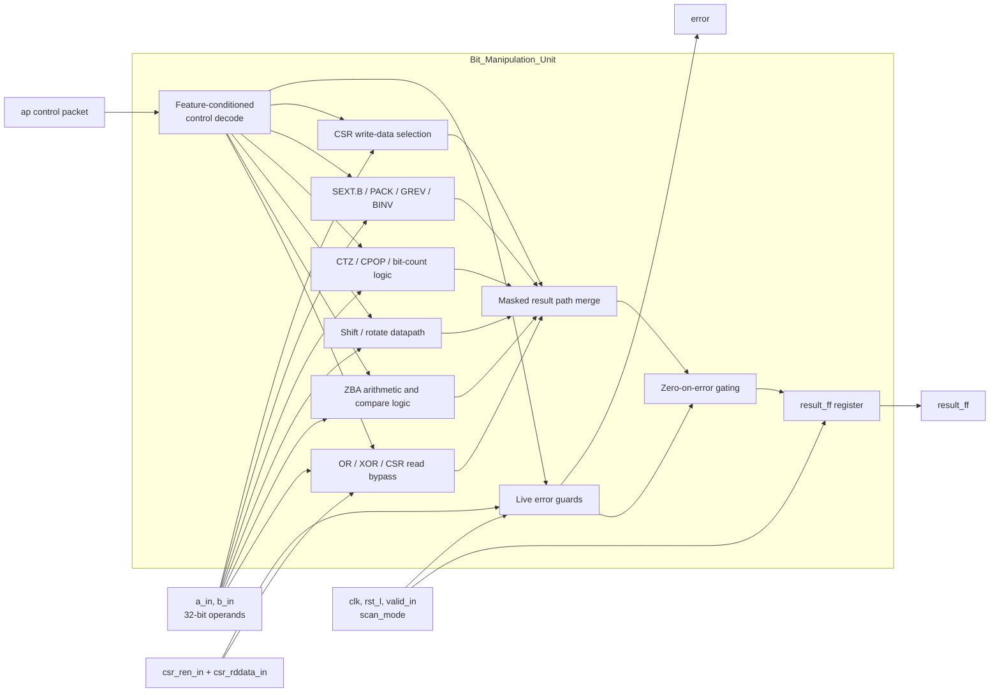
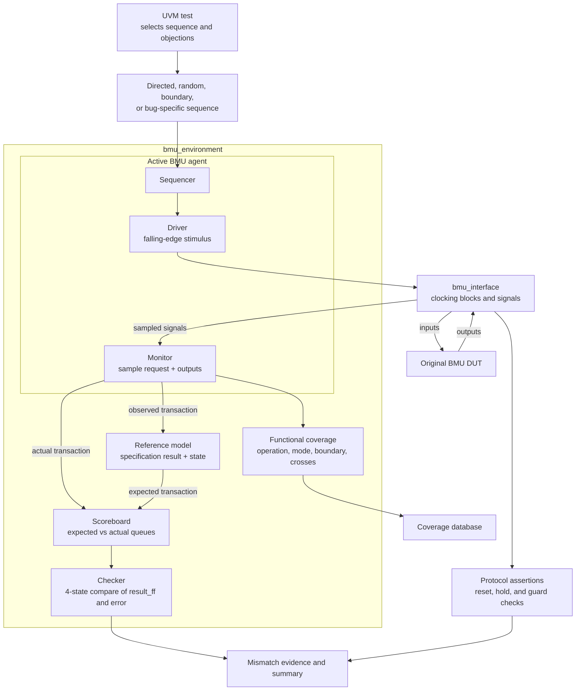

# BMU Verification Project

<div align="center">


**Specification-driven verification of a 32-bit RISC-V Bit Manipulation Unit.**

[Specification](docs/00_spec/BMU_Specification_v1.2.pdf) · [Test plan](docs/02_test_plan/BMU_Test_Plan.md) · [Bug log](docs/04_bug_reports/BMU_Bug_Log.md) · [Regression results](results/reports/regression_summary.csv)

</div>

This repository is a complete verification package for the original BMU DUT: it contains the specification baseline, the UVM environment, predictor and scoreboard logic, assertion set, directed and random stimulus, regression configuration, measured coverage, and the reproduced bug evidence used to evaluate the delivered RTL.

The objective is straightforward but exacting: validate the DUT against BMU Specification v1.2, find and reproduce design bugs, and preserve evidence in a way a reviewer can trust without needing to read the entire tree. The original DUT is retained exactly as delivered, and the project intentionally keeps the failing reproducer tests as evidence instead of hiding them behind a fixed RTL.

## Table of contents

- [1. Project overview](#1-project-overview)
- [2. What is in this repo](#2-what-is-in-this-repo)
- [3. Architecture at a glance](#3-architecture-at-a-glance)
  - [3.1 DUT architecture](#31-dut-architecture)
  - [3.2 UVM environment architecture](#32-uvm-environment-architecture)
- [4. DUT contract and core behavior](#4-dut-contract-and-core-behavior)
- [5. Verification methodology](#5-verification-methodology)
- [6. Regression and test strategy](#6-regression-and-test-strategy)
- [7. Coverage and measured results](#7-coverage-and-measured-results)
- [8. Reproduced bug findings](#8-reproduced-bug-findings)
- [9. Quick start and reproduction](#9-quick-start-and-reproduction)
- [10. Evidence map and repository layout](#10-evidence-map-and-repository-layout)
- [11. Assumptions, limits, and submission status](#11-assumptions-limits-and-submission-status)

---

## 1. Project overview

| Item | Project baseline |
|---|---|
| Design under test | `Bit_Manipulation_Unit` (32-bit data path, registered output) |
| Verification authority | BMU Specification v1.2 and saved clarifications |
| Functional scope | 17 operation classes plus the required legal/illegal control combinations |
| Methodology | SystemVerilog + UVM, independent predictor, scoreboard, assertions, functional coverage |
| Simulator | Cadence Xcelium 25.03-s006 with UVM 1.1d |
| Coverage tool | Cadence IMC 25.09-a020 |
| Baseline regression | 26 total runs; 3 passed and 23 failed; zero UVM fatals |
| Predictor validation | 865 self-checks passed |
| Functional coverage | 562 / 562 bins exercised (100.00%) |
| Open DUT findings | 9 documented findings remain open |
| Submission status | Verification evidence complete for training; DUT correctness is not signed off |

This project is intentionally evidence-first. Every important result is tied to a spec rule, an execution log, a coverage file, or a bug reproducer. The verification baseline and source provenance are recorded in [docs/00_spec/verification_input_baseline.md](docs/00_spec/verification_input_baseline.md) and [results/reports/run_manifest.json](results/reports/run_manifest.json). The `fix_v1` RTL files are exploratory only; the default flow and reported evidence use the original DUT.

---

## 2. What is in this repo

This is not just RTL plus a testbench. It is a verification package that includes:

- The original DUT implementation in [rtl](rtl)
- UVM components for stimulus, monitoring, checking, and coverage in [tb](tb)
- A reference model and prediction logic in [tb/env](tb/env)
- Protocol assertions in [tb/assertions](tb/assertions)
- Directed and random regression configs in [regression/configs](regression/configs)
- Measured coverage, logs, and bug reproducer output in [results](results)
- Planning, clarifications, coverage summaries, and signoff documents in [docs](docs)
- Documentation and diagram generation tooling in [scripts](scripts)

This is a typical engineering evidence package for a defensive verification task: the DUT is checked against a spec, failures are reproduced, and the artifacts are preserved in a reviewable form.

---

## 3. Architecture at a glance

### 3.1 DUT architecture



The module is a register-backed compute block with a live combinational error signal. The control packet (`ap`) selects the operation, valid state controls the capture, and the result is stored in `result_ff` on the active clock edge. The error logic is intentionally incomplete compared to the full spec, which is why the project reports open DUT bugs instead of a passing closure.

### 3.2 UVM environment architecture



This environment is built around real stimulus and independent prediction: the driver writes requests into the DUT, the monitor samples both input request and output response, the reference model predicts expected behavior, and the scoreboard compares the two. The predictor is specification-based and is not a duplicate of the RTL datapath.

---

## 4. DUT contract and core behavior

The BMU is a 32-bit combinational datapath with a registered output. The verified contract is:

- `clk` drives register capture
- `rst_l` is active-low reset
- `valid_in` controls whether a new result is captured; if low, the previous result holds
- `scan_mode` is part of the interface assumption and is treated as non-functional for the main verification scope
- `ap` is the packed control packet containing the operation modifiers and companion fields
- `a_in` and `b_in` are the 32-bit operands
- `result_ff` stores the captured result
- `error` is a live indication that the request is invalid or unsupported under the current control combination

The project checks the following representative operation classes and legal control combinations:

| Operation family | Representative behavior |
|---|---|
| Logical ops | OR, XOR with optional inversion mode |
| Shift/rotate | SRL, SRA, ROR |
| Compare / sub | SUB, SLT, SLTU, MAX |
| Bit-count / bit-manip | CTZ, CPOP, BINV |
| Data rearrangement | PACK, GREV, SEXT.B |
| CSR handling | CSR write-data selection and CSR bypass read |

Important rule of thumb: legal operation requests are not simply “one-hot on every field.” Some legal combinations intentionally include companion fields such as `slt + sub`, `max + sub`, and `sh2add + zba`. Illegal control combinations, missing required fields, and CSR conflicts must drive `error=1` when `valid_in` is active.

---

## 5. Verification methodology

The project uses a specification-driven verification methodology instead of a direct RTL-equivalence approach.

### Core components

- [tb/top/bmu_tb_top.sv](tb/top/bmu_tb_top.sv): top-level testbench instantiation
- [tb/interface/bmu_interface.sv](tb/interface/bmu_interface.sv): DUT interface and clocking blocks
- [tb/env/bmu_environment.sv](tb/env/bmu_environment.sv): environment instantiation and signal routing
- [tb/env/reference_model/bmu_reference_model.sv](tb/env/reference_model/bmu_reference_model.sv): independent expected-value model
- [tb/env/scoreboard/bmu_scoreboard.sv](tb/env/scoreboard/bmu_scoreboard.sv): queues and transaction comparison
- [tb/env/scoreboard/bmu_checker.sv](tb/env/scoreboard/bmu_checker.sv): mismatch and pass/fail summaries
- [tb/assertions/bmu_protocol_assertions.sv](tb/assertions/bmu_protocol_assertions.sv): reset, valid, hold, and guard properties
- [tb/env/coverage/bmu_coverage.sv](tb/env/coverage/bmu_coverage.sv): functional coverage modeling

### Why it is credible

- The predictor is independent of the DUT datapath. It uses spec expressions and legal control masks.
- The monitor samples the actual input request and output response together.
- The checker compares both `result_ff` and `error` using four-state logic so X/Z differences are visible.
- Assertions enforce protocol-level guarantees such as reset behavior, result hold, and guard conditions.
- Coverage covers operation-specific branches, boundary values, legal and illegal control patterns, and multiple reset/valid combinations.

---

## 6. Regression and test strategy

The regression includes both focused diagnostics and systematic randomness. The full configuration is in [regression/configs/full.cfg](regression/configs/full.cfg).

| Test family | Purpose | Outcome |
|---|---|---|
| `bmu_model_self_test` | Validate reference-model logic independently | PASS |
| `bmu_or_valid_test` | Basic legal result capture path | PASS |
| `bmu_timing_reset_test` | Timing, reset, hold, and back-to-back traffic | PASS |
| `bmu_nominal_directed_test` | Nominal legal operation checks | FAIL |
| `bmu_error_directed_test` | Illegal-request paths and expected rejects | FAIL |
| `bmu_gap_checks_test` | Boundary and targeted guard checks | FAIL |
| `bmu_guard_matrix_test` | Allowed/forbidden control combinations | FAIL |
| `bmu_coverage_closure_test` | Coverage closure and operational sweep | FAIL |
| `bmu_legal_random_test` | Random legal traffic across operations and modes | FAIL |
| `bmu_corner_random_test` | Independent operand corners and boundary values | FAIL |
| `bmu_error_random_test` | Invalid-operation random exploration | FAIL |
| `bmu_bug_NNN_test` | Isolated reproducer per bug | FAIL as intended |

The suite intentionally stresses:

- all 32 shift amounts and bit indices
- CTZ and CPOP edge-case values
- signed and unsigned comparisons
- GREV encoding legality and forbidden values
- CSR write-data and read-bypass conflicts
- reset, hold, and back-to-back capture timing

This is why the project does not report “pass” once coverage is high; it reports failures as evidence of real DUT defects.

---

## 7. Coverage and measured results

The baseline coverage run is `bmu_coverage_closure_test` with seed 4. The scoreboard compared 5,036 transactions: 3,488 matched and 1,548 mismatched. The same run reported 513 assertion failures, and zero UVM fatals.

| Measurement | Recorded result | Interpretation |
|---|---:|---|
| Functional bins | 562 / 562 — **100.00%** | All model-defined scenarios exercised |
| DUT hierarchy blocks | 16 / 16 — **100.00%** | Instrumented blocks reached |
| DUT hierarchy expressions | 3 / 3 — **100.00%** | Default expression coverage reached |
| DUT hierarchy toggles | 1,230 / 1,892 — **65.01%** | Toggle coverage remains incomplete |
| IMC assertion coverage | 11 / 13 — **84.62%** | Tool metric, not pass status |
| FSM coverage | No FSM reported | No claim of FSM completeness |

This is important: 100% functional coverage does not mean the DUT is correct. It only means the checks reached all defined bins. The project preserves the coverage files and the limitations in [docs/07_coverage_reports/final_coverage_summary.md](docs/07_coverage_reports/final_coverage_summary.md) and [docs/07_coverage_reports/coverage_waivers.md](docs/07_coverage_reports/coverage_waivers.md).

---

## 8. Reproduced bug findings

Nine DUT findings were reproduced on the original design. They are retained as compact evidence under [results/bugs](results/bugs) and summarized in the canonical bug log at [docs/04_bug_reports/BMU_Bug_Log.md](docs/04_bug_reports/BMU_Bug_Log.md).

| ID | Severity | Example trigger | Expected vs observed |
|---|---|---|---|
| [BMU-BUG-001](results/bugs/BMU-BUG-001.txt) | Major | CPOP on `0xFFFF0000` | Count `16 -> 0` |
| [BMU-BUG-002](results/bugs/BMU-BUG-002.txt) | Major | PACK with swapped halves | `0x56781234 -> 0x12345678` |
| [BMU-BUG-003](results/bugs/BMU-BUG-003.txt) | Major | CSR write-data selection | Immediate and register paths reversed |
| [BMU-BUG-005](results/bugs/BMU-BUG-005.txt) | Major | GREV byte reversal | Halfword swap instead of byte reorder |
| [BMU-BUG-006](results/bugs/BMU-BUG-006.txt) | Critical | Empty valid request | `error=1` missing |
| [BMU-BUG-007](results/bugs/BMU-BUG-007.txt) | Major | Invalid SLT/MAX without SUB | Missing error path |
| [BMU-BUG-008](results/bugs/BMU-BUG-008.txt) | Major | GREV with illegal encoding | Error not raised |
| [BMU-BUG-009](results/bugs/BMU-BUG-009.txt) | Major | CTZ on `1` | Count is reversed/inaccurate |
| [BMU-BUG-010](results/bugs/BMU-BUG-010.txt) | Major | Signed MAX with SUB | Result selection reversed |

The failure count is not noise; it is evidence that the original DUT violates the spec in multiple independent ways. A failing bug reproducer is intentionally preserved as a failure case so that the evidence remains reviewable.

---

## 9. Quick start and reproduction

### Prerequisites

| Tool | Requirement |
|---|---|
| Xcelium | Tested with 25.03-s006 and UVM 1.1d |
| IMC | Needed for coverage extraction |
| Shell tools | Bash, GNU Make, Python 3.6+ |
| Optional | Graphviz and markdown tooling for static docs generation |

### Quick pass checks

```bash
make -C sim compile
make -C sim run TEST=bmu_model_self_test SEED=1
make -C sim run TEST=bmu_or_valid_test SEED=1
make -C sim run TEST=bmu_timing_reset_test SEED=1
```

These are useful sanity checks before exploring the failing bug cases. The project baseline includes the original DUT defects; therefore the regression is expected to fail on the delivered RTL.

### Full regression

```bash
make -C sim regression
```

This runs the configured regression suite and returns nonzero status when the original DUT fails, which is the expected outcome for the submitted baseline.

### Focused reproducer

```bash
make -C sim run TEST=bmu_bug_010_test SEED=1 VERBOSITY=UVM_LOW
```

### Coverage and waveforms

```bash
imc -exec sim/scripts/report_coverage.tcl
make -C sim waves TEST=bmu_or_valid_test SEED=1
python3 sim/scripts/summarize_regression.py regression/configs/full.cfg
```

### Documentation generation

```bash
bash scripts/lint_docs.sh
python3 scripts/generate_diagrams.py
```

---

## 10. Evidence map and repository layout

```text
BMU-verification/
├── rtl/                         Original DUT, parameters, libraries, exploratory fix variant
├── tb/
│   ├── top/                     DUT/interface instantiation and test startup
│   ├── interface/               Signal definitions and clocking blocks
│   ├── packages/                UVM helper types and specification libraries
│   ├── env/                     Agent, predictor, scoreboard, coverage
│   ├── assertions/              Protocol-check assertions
│   ├── sequences/               Directed, random, boundary, and bug-specific sequences
│   └── tests/                   Top-level test selection
├── sim/                         Makefile, run scripts, filelists
├── regression/configs/          Full and focused regression configuration files
├── results/
│   ├── bugs/                   Compact evidence for isolated findings
│   ├── coverage/                Generated coverage databases
│   ├── logs/                   Simulation logs and reports
│   └── reports/                 Summary CSVs, manifests, coverage text files
├── docs/
│   ├── 00_spec/                 Spec and baseline information
│   ├── 01_verification_plan/     Verification strategy and randomization plan
│   ├── 02_test_plan/            Test plan and traceability matrix
│   ├── 03_clarifications_log/   Design clarifications and assumptions
│   ├── 04_bug_reports/          Canonical bug log
│   ├── 06_architecture_diagrams/
│   ├── 07_coverage_reports/     Coverage summaries and limitations
│   └── 08_signoff/              Final signoff report
├── scripts/                     Documentation checks and diagram generation
├── waveforms/                   Generated waveform databases
├── LICENSE
├── CHANGELOG.md
├── README.md
└── docs/README.md
```

The most important artifacts for a reviewer are:

- [docs/00_spec/BMU_Specification_v1.2.pdf](docs/00_spec/BMU_Specification_v1.2.pdf)
- [docs/02_test_plan/BMU_Test_Plan.md](docs/02_test_plan/BMU_Test_Plan.md)
- [docs/04_bug_reports/BMU_Bug_Log.md](docs/04_bug_reports/BMU_Bug_Log.md)
- [results/reports/regression_summary.csv](results/reports/regression_summary.csv)
- [results/reports/run_manifest.json](results/reports/run_manifest.json)
- [docs/07_coverage_reports/final_coverage_summary.md](docs/07_coverage_reports/final_coverage_summary.md)
- [docs/08_signoff/BMU_Signoff_Report.md](docs/08_signoff/BMU_Signoff_Report.md)

---

## 11. Assumptions, limits, and submission status

The project records a few explicit assumptions because design-team confirmation was unavailable.

| Clarification | Adopted behavior | Impact |
|---|---|---|
| CLARIF-001 | Rising-edge registration, hold on valid low, active-low reset, live error | Timing and reset contract for checks |
| CLARIF-004 | GREV with `b_in[4:0] != 24` is invalid and must raise an error | GREV legality and bug checks |
| CLARIF-005 | Pure CSR bypass is legal; CSR read combined with operation controls is invalid | CSR conflict classification |

The open findings remain open because the supplied DUT has not been fixed. The repository does not claim exhaustive verification, complete toggle coverage, validation of excluded operations, or closure of the design issue. The corrected invalid-operation error rows and `CTZ(0)=32` are separately recorded in the clarifications log; the final status remains a reproducible, evidence-backed bug report, not a signed-off design.

This README is the project brief, architecture guide, verification map, and evidence summary in one place. If you read only this file, you should still understand the DUT, the verification environment, the checks being performed, the measured results, and the status of the open findings.

See [LICENSE](LICENSE) for the repository’s scope-limited terms; the supplied specification and RTL are excluded from that grant.
